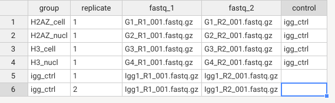
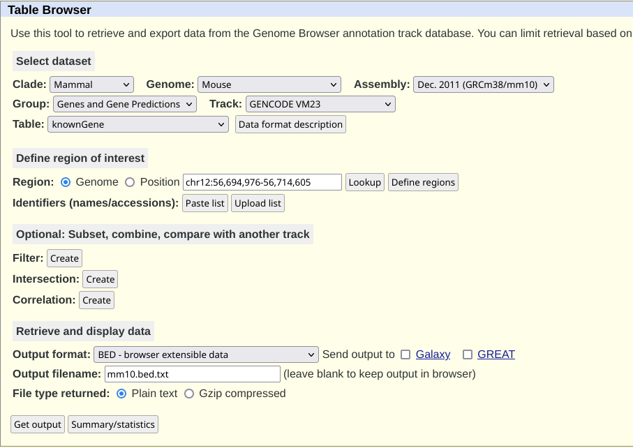

# Introduction

This is a tutorial developed for analyzing data from Cut & Run experiments.


Originally, I was aiming to use the [CUT&RUN Tools](https://github.com/fl-yu/CUT-RUNTools-2.0) 
but it is no longer maintained and very hard to get working.

Instead, I found a better version that uses [NextFlow]() to run the analysis. This means that it can also run on high performance clusters with ease since others places have NextFlow installed.

The tutorial is based on the [nf-core/cutandrun](https://nf-co.re/cutandrun/3.2.2/) pipeline. 
This tutorial may be out of date for the step 3 and onwards so check the original documentation.

# Step 1: Install dependencies

## Install nix

This info is from the [nixos website](https://nixos.org/download)

### Windows
If you have windows, first install [Windows Subsystem for linux](https://learn.microsoft.com/en-us/windows/wsl/install)

Then press start and open the linux terminal.

In the terminal, run the following command:

```
sh <(curl -L https://nixos.org/nix/install) --daemon
```

### MacOS

Open terminal and run:

```
sh <(curl -L https://nixos.org/nix/install)
```

### Linux

Install the nix from your package manager. If not available, run:

```
sh <(curl -L https://nixos.org/nix/install) --daemon
```

## Enable nix flakes

In the same terminal, run the following two commands to enable flakes:

```
mkdir -p ~/.config/nix
echo "experimental-features = nix-command flakes" >> ~/.config/nix/nix.conf
```

# Step 2: Setup the project folder

## Download the data files

Download the files  
Make sure all the `.fastq.gz` files are in the same place as each other.

## Download the project scripts

Use the following command to download the files in this repo in your own system.

```
git clone https://github.com/ArvinZaker/cut_run_pipeline_nix
```

If you have already download this repo you dont need to do this.

## Place them in one place

Put all the `.fastq.gz` files in the github folder


## Open the terminal in the project folder

The instructions is different for each system:
- On linux, press `Alt + F4` in the folder and the terminal should open.
- One windows, hold `Shift` and right click on the file. Click on `Open in Linux Shell`
- On mac, follow [this guide](https://support.apple.com/en-ca/guide/terminal/trmlb20c7888/mac)


# Step 2: Setup the development environment

In your terminal, simplify run

```
nix develop --impure
```

After you enter the nix shell, run:

```
curl -s https://get.nextflow.io | bash
```

And thats it! The beauty of nix allows it to be this simple to make everything ready.

# Step 3: Prepare anaylsis

By now, your folder should have the following structure:

```
> ls
  sheet.csv
  README.md
  nextflow.config
  nextflow
  flake.nix
  flake.lock
  conf/
  <cut-run experiment files>.fastq.gz
  ...
```

Before running the analysis, we have to configure the pipeline.
There are two main config files. Which we will be discussing now:


> NOTE: these two parts from the pipeline's [usage page](https://nf-co.re/cutandrun/3.2.2/docs/usage)

## Configuring nextflow.config

The `nextflow.config` file is for tuning the parameters in the run.
The most important segment to modify for running this on any system are the following lines which tell the pipeline how much memeory to use:

```
    // Max resource options
    max_memory                 = "60.GB"
    max_cpus                   = 10
    max_time                   = "1000h"
```

The authors have dedicated ~6GB of ram per CPU core, please maintain that ratio.

The max_time variable is only important for running it on clusters like compute-canada. For running on your own system you can set this as high as you want.

If the quality of the alignment is not good, you can modify it by reading the [Pipeline Configuration Options](https://nf-co.re/cutandrun/3.2.2/docs/usage) for the pipeline.


## Configuring sheet.csv

The `sheet.csv` file is for inputting the sample metadata for the nextflow function.

.

To fill it for your own data, do the following:

1. Each sample is in one row.
2. Put the group the sample belonds in the `group` column.
3. Put which replicate it is (aka if you have two samples with the same `group`, give one the number `1` and the other the number `2`)
4. Put the corresponding R1 and R2 fastq files in the `fastq_1` and `fastq_2` columns.
5. **If the group is not IgG control:** Add the igg_ctrl at the end to specify the controls.

And with this you are good to go!

# Step 4: Run the analysis

To run the analysis, simplify run this command.

```
./nextflow run nf-core/cutandrun -r 3.2.1 --input ./sheet.csv  --outdir ./results/ --genome GRCh38 -profile docker -c ./nextflow.config --save_reference --save_trimmed
```

The main things that you may have to change for your sample are:

1. **Selecting the correct specie**: Change the `--genome` argument to the specie of your choice. Please see the [igenome](https://support.illumina.com/sequencing/sequencing_software/igenome.html) website to select the correct genome.
2. Updaing the version in the `-r` argument.
3. If you want the process to run in background at `-bg` option to the command.

> NOTE: IT IS EXTREMELY IMPORTANT 

# Step 5: Results of the analysis.

All the results are in the `./results/` section.

The most important folder is `./results/03_peak_calling/05_consensus_peaks/` since it has the files declaring where are the peaks.

The quality control graphs are in `./results/04_reporting/` folder with many graphs which you can use to check the quality. 
Some files to look at would be:

## `04_reporting/multiqc/multiqc_plots/pdf` folder

`mqc_fastqc_sequence_counts_plot-2_1.pdf`

- Check for consistency of sequence counts across the samples.
- Check if you have too much duplicated reads in the sample.

`mqc_fragment_lengths-plot_1.pdf`:

- Check if the fragment length distribution is expected for your experiment.

`mqc_fastqc_per_base_sequence_quality_plot-2_1.pdf`

- Check if the sequences have consistently high quality across the base pairs

`mqc_fastqc_per_sequence_quality_scores_plot-2_1.pdf`

- Check if all the sequences (aka the curve) are in the high quality region.

`mqc_fastqc_per_sequence_gc_content_plot_Percentages.pdf`

- Check if the GC content is too high for the sequence.
- Check if you have multiple peaks: This might indicate contamination.
- Check if any of the curves are red-colored: This might indicate contamination.

`mqc_fastqc_sequence_duplication_levels_plot-2_1.pdf`

- Check to see if there are peaks in the right of the axis. This might indicate a problem with the alignment/protocol.

`mqc_cutadapt_trimmed_sequences_plot_3_Counts.pdf`

- This indicates the lenght of sequence trimmed because of the adapters. As a result, the curves should be a sharp J distribution.
- Check if there are sequences that have been cut too much.
- Check and see if the consistency of the adapters (at the bottom) is what you expect (aka do all of them have the same adapter?)

## Other files

`./results/04_reporting/deeptools_heatmaps/gene_all/all_genes.plotHeatmap.pdf`

- This plot shows the distribution of the fragment found in the human genome (y axis of the heatmap) and its distribution in the TSS-TES region.
- Check if the fragments are from a correct range of genes. For e.g, if your gene is specific, you should see blue and yellow for a small porition of the plot. Consequently, if the protein targetter is non-specific then you should see a lot of yellow and green across the page.
- Check if the binding profile at the top is what you expect of the protein. For e.g if the protein is found only in TSS, you should not see much binding in TES.

# MISC

If you want a one-command to put for compute canada, use this command:


```
nix develop --command curl -s https://get.nextflow.io | bash && chmod +x ./nextflow && ./nextflow -bg run nf-core/cutandrun -r 3.2.1 --input ./sheet.csv  --outdir ./results/ --genome GRCh38 -profile docker
```

+ Information on alignment q score from Illumina website is [available here](https://www.illumina.com/science/technology/next-generation-sequencing/plan-experiments/quality-scores.html)
+ 


## Downloading gene annotation bed files

The [MethylKit package](https://www.bioconductor.org/packages/release/bioc/vignettes/methylKit/inst/doc/methylKit.html#4_Annotating_differentially_methylated_bases_or_regions) recommends using the package `genomation` in conjuction with a `.bed.txt` file to annotate which part of the genome each gene resides in.

For this purpose, I wanted to aquire the latest mouse genome.

I went to [UCSC table browser](https://genome.ucsc.edu/cgi-bin/hgTables) And did the following:

- `Genome` as `Mouse`
- `Assembelly` as `GRCm38/mm10`
- `Output format` as `Bed`
- `Output filename` as `mm10.bed.txt`

The page would look like: 



Then I clicked `get output`. In the follwing page I clicked `get BED`

The file I used is currently in `./databases/`

## Downloading CpGi annotation bed files.

According to [this forum](https://www.biostars.org/p/236141/) I used this command to get the annotation of CpG islands for the mouse genome.

```
wget -qO- http://hgdownload.cse.ucsc.edu/goldenpath/mm10/database/cpgIslandExt.txt.gz | gunzip -c |  awk 'BEGIN{ OFS="\t"; }{ print $2, $3, $4, $5$6, $7, $8, $9, $10, $11, $12 }'  > cpgIsland.mm10.bed
```